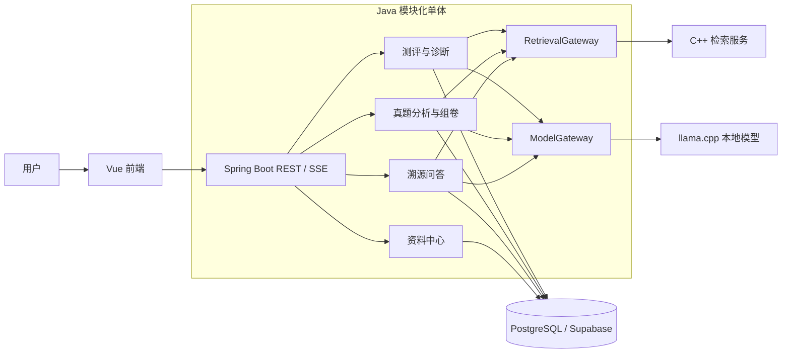

# 知序 StudyPilot

基于本地大语言模型与 RAG 的多场景智能备考系统。

StudyPilot 面向课程考试、考研、笔试和面试等以文本资料为主的备考场景。系统以课程项目作为数据边界，将资料管理、知识问答、考频分析、智能组卷和在线测评连接成完整流程。

> 课程版原型已归档。当前分支已完成目标架构、三个业务模块、系统级验证与最终交付文档。

## 当前开发阶段

Agent Harness、四项架构任务、数据库任务与基础集成任务已验证完成。课程版原型（含考频、模拟出题和答题评测的最小闭环）已归档；资料知识库、溯源问答、真题分析、模拟卷生成、在线作答与智能测评已完成。

- Agent 入口：[AGENTS.md](AGENTS.md)
- Harness 状态：[docs/harness/](docs/harness/README.md)
- 架构、数据库、接口和决策：[docs/关键记录/](docs/关键记录/README.md)
- 已完成任务：`HARNESS-001`、`ARCH-001` 至 `ARCH-004`、`DB-001`、`INT-001`，状态均为 `verified`
- 当前任务：`VERIFY-001`，完成系统级验证与交付准备

后续开发顺序固定为：架构重构、数据库与基础链路、三个产品模块、系统验证、最终交付。具体依赖和验收标准以 `docs/harness/feature_list.json` 为准。

## 产品闭环

```text
创建备考项目
  → 上传教材、讲义、知识点、历年真题和参考答案
  → 构建项目知识库
  → 基于资料进行溯源问答
  → 分析历年真题的知识点考查频次
  → 生成全新的模拟试卷
  → 在线作答
  → 自动测评并查看逐题反馈
```

## 核心模块

### 1. 课程资料与知识问答

- 在知识问答页面右侧上传、查看和删除文字型 PDF；
- 对 PDF 进行分页提取、文本分块并建立 C++ 检索索引；
- 优先使用当前课程资料回答，展示真实资料名、页码和原文；
- 没有资料或没有命中时使用本地模型通用知识回答，不生成虚假引用；
- 保存问答会话和历史，刷新或切换模块后可以恢复。

### 2. 智能组卷、在线作答与测评

- 输入要求或留空直接生成默认练习，不强制指定参考试卷；
- 当前固定生成 2 道单项选择题和 2 道简答题；
- 校验模型返回的 JSON、题型、选项、答案、解析、知识点和分值；
- 生成任务在切换模块后继续执行；
- 保存历史练习，支持删除和重新作答；
- 选择题规则判分，简答题由本地模型按照评分要求返回分数和反馈。

### 3. 历年试卷考频分析

- 自动列出当前课程中已经识别的历年试卷，无需填写资料编号；
- 根据常见题号标记切分试题并记录来源页码；
- 使用确定性词典提取和归一知识点；
- 按“知识点被多少道题考查”统计频次；
- 无法归一的题目计入待人工补充，不生成虚假结果；
- 重新分析同一试卷时替换旧结果，避免重复累计。

在线作答和测评从智能组卷进入，不设置独立一级导航。详细实现与团队归属见 [产品架构](docs/产品相关/产品架构.md) 和 [团队分工与模型测试](docs/产品相关/团队分工与模型测试.md)。

## 已确定的产品边界

- 项目是最高层业务边界。资料、对话、引用、试卷、作答和报告都必须绑定项目，项目之间严格隔离。
- 课程可归档和恢复；归档会隐藏课程入口，但会保留课程内的资料、问答、模拟考和测评记录。
- 资料删除会移除文件和检索索引，但已经保存的问答引用快照仍可查看。
- 目前只处理能够直接提取文字的 PDF，不增加 OCR、图像识别或多模态理解能力。
- 真题中的其他文本题型可以参与知识点分析；系统最终生成、作答和测评的题型仅限单项选择题与简答题。
- 模拟考不是预测系统。历年真题用于分析题型、难度、频率和知识点分布，不承诺命中原题。
- 系统按本地个人使用场景设计，当前不包含登录、注册、角色权限和多用户账号体系。
- Agent 不是强制目标。资料问答、真题分析和模拟测评优先采用可验证的固定智能工作流；只有模型自主选择工具并根据中间结果调整步骤时才称为 Agent。

## 总体架构



### 目标架构基线

| 层次 | 目标方案 |
| --- | --- |
| 前端 | Vue 3、TypeScript、Vite、Vue Router、Pinia、shadcn-vue、Tailwind CSS |
| 后端 | Java 21、Spring Boot 3.5、Spring MVC、Bean Validation、Spring JDBC |
| 后端组织 | 单个 Spring Boot 模块化单体，按 `document`、`qa`、`exam`、`assessment` 等业务能力划分 |
| 数据库 | PostgreSQL，通过 JDBC 访问；本地演示可使用临时嵌入式 PostgreSQL |
| 检索 | 独立 C++ 检索服务，后端通过 `RetrievalGateway` 调用 |
| 模型 | 独立本地模型服务，后端通过 `ModelGateway` 调用 llama.cpp |
| 文档处理 | Apache PDFBox，暂不处理扫描件 |
| 测试 | JUnit 5、Mockito、Vitest、Vue Test Utils、MSW、Playwright |

后端业务模块只依赖 Gateway 接口，不直接管理 C++ 服务、模型进程或端口。跨模块读取通过公开的查询 Service 或只读 DTO 完成，禁止直接访问其他模块的 Repository。

前端采用 `app / modules / shared` 三层结构：业务模块拥有自己的 API、页面、组件、状态和校验；外部 DTO 必须经过运行时 Schema 校验和 mapper 转换后才能进入内部模型；普通 HTTP 请求统一经过 Axios 实例。

## 当前可运行目标版本

当前工作目录是目标版本：以“备考项目”为边界，使用 PostgreSQL、资料驱动组卷和结构化模型评分。课程版原型仅保留在 `archive/legacy-course-prototype` 分支供回看，不能使用其中的 MySQL 启动脚本。

### 快速体验（无需预装 PostgreSQL）

在仓库根目录执行：

```powershell
.\scripts\start-local-demo.ps1
```

随后访问 <http://127.0.0.1:5173/>。该命令使用临时嵌入式 PostgreSQL，关闭服务后数据不作为正式资料保留；正式部署仍按 [部署与运行指南](docs/部署与运行指南.md) 配置 PostgreSQL。

目标版本已经实现 PDF 资料处理、溯源问答、真题分析、固定四题模拟卷、在线作答与测评。完整运行需要 PostgreSQL、C++ 检索服务和本地模型服务；详细功能边界见 [产品架构与当前实现](docs/产品相关/产品架构.md)。

## 目标仓库结构

仓库按技术域拆分为前端、后端和 C++ 三个主要目录，并在根目录提供公共文档、数据结构和协议约束，供三个技术目录共同遵守。业务分工以模块为单位，避免只按技术栈切分任务。

```text
StudyPilot/
├── frontend/                    # Vue 前端应用
│   └── src/
│       ├── app/                 # 应用启动、路由、全局装配
│       ├── modules/             # 业务模块
│       │   ├── document/        # 资料中心
│       │   ├── qa/              # 溯源问答
│       │   ├── exam/            # 真题分析与模拟组卷
│       │   └── assessment/      # 在线作答、测评与诊断
│       ├── shared/              # UI、API、配置、样式和工具
│       └── types/               # 跨应用共享类型
│
├── backend/                     # Spring Boot 后端模块化单体
│   └── src/
│       ├── main/java/cn/studypilot/
│       │   ├── common/          # 响应、异常、校验和基础配置
│       │   ├── document/        # 资料管理
│       │   ├── model/           # 模型 Gateway 与运行记录
│       │   ├── retrieval/       # 检索 Gateway
│       │   ├── qa/              # 溯源问答
│       │   ├── exam/            # 真题分析与组卷
│       │   └── assessment/      # 在线作答与测评
│       ├── main/resources/      # 配置和数据库脚本
│       └── test/                # 后端测试
│
├── ai/                          # C++ 检索、队列和本地模型服务
│   ├── src/                     # C++ 源码
│   └── ...                      # 构建脚本和服务运行文件
│
├── common/                      # 三个技术目录共用的内容
│   └── ...                       # 数据结构、协议约束等公共内容
│
├── docs/                        # 产品规划、架构设计和需求约束
├── scripts/                     # 安装、启动、构建和测试入口
└── tests/                       # 集成、端到端和模型评测
```

目标结构中的依赖方向为：`frontend → backend API → database / Gateway`，`backend → ai service`，三个技术目录共同遵守 `common` 中的接口和协议约束。前端不直接访问数据库或本地模型，后端业务模块不直接依赖 C++ 实现细节。

当前仓库中的 `common/` 目标目录尚未独立创建；其中的共享约束目前分散记录在 `docs/`、`backend/docs/后端框架设计.md` 和 `frontend/前端框架设计.md` 中，具体公共子目录在创建正式工程骨架时统一确定。

## Windows 快速开始

当前目标版本使用 PostgreSQL、C++ 检索服务与 llama.cpp，不使用早期课程版的 MySQL 脚本。完整的依赖准备、数据库初始化、模型启动、停止和测试步骤见 [部署与运行指南](docs/部署与运行指南.md)。

已配置数据库环境变量并启动本地模型后，在仓库根目录执行：

```powershell
.\scripts\start-target.ps1 -StartAiService
```

浏览器访问：<http://127.0.0.1:5173>。运行日志、进程记录和测试产物默认写入 `D:\大四课程设计\StudyPilot-output`；用户资料和 C++ 索引默认写入 `D:\大四课程设计\StudyPilot-runtime`。

停止由该入口启动的服务：

```powershell
.\scripts\stop-target.ps1
```

## 构建与测试

```powershell
# 后端单元、集成与真实 PostgreSQL Schema 测试
cd backend
.\mvnw.cmd test

# 前端静态检查、单元测试与生产构建
cd ..\frontend
pnpm run check

# 在仓库根目录汇总执行上述检查、Harness 和模拟卷 HTTP 工作流
cd ..
.\scripts\verify-target.ps1
```

最近一次测试记录覆盖：

- 2026-09-09：`scripts\verify-target.ps1` 通过，后端 41 项测试零失败，2 项需外部 C++／模型服务的测试按设计跳过；
- 前端 ESLint、Prettier、TypeScript、Vitest 和生产构建通过，测评页面覆盖“加载试卷、自动创建作答、提交完整答案、显示评分报告和再次作答”的交互测试；
- `MockExamWorkflowEndToEndTest` 通过，覆盖项目、PDF 导入、模拟组卷、独立作答与评分的真实 HTTP 路径，并使用临时 PostgreSQL；
- Harness 结构和任务状态检查通过。每次运行生成的摘要与详细日志保存在 `D:\大四课程设计\StudyPilot-output`。

## 模型评测结论

当前启动脚本使用 **Qwen3.5-4B Q4_K_M**。三模型多任务 Benchmark 中，Qwen3.5-4B 综合分为 78.62，Qwen3-4B 为 78.37，Phi-4-mini-instruct 为 38.78。Qwen3.5-4B 的专业题和评分表现较好；Qwen3-4B 的平均首 Token 时间约 0.067 秒，结构输出和请求成功率更稳定；Phi-4-mini-instruct 虽然速度最快，但中文专业任务质量不足。

三名成员分别复核一款模型，最终系统统一使用一款默认模型。评测数据与原始证据见：

- `tests/model-evaluation/模型选型实测报告.md`
- `tests/model-evaluation/summary.json`
- `tests/model-benchmark/README.md`
- `tests/model-benchmark/benchmark-summary.csv`

## 推荐演示流程

1. 创建两门课程，演示课程切换和数据隔离。
2. 在知识问答页上传教材或讲义，提问并查看资料名称、页码和引用片段。
3. 提出一条资料中没有的问题，展示本地模型的通用知识回答。
4. 上传历年试卷，进入考频分析页直接选择试卷开始分析。
5. 展示识别题数、已归一题数、待人工补充题数和知识点频次。
6. 进入智能组卷，输入要求或留空生成默认练习。
7. 在线完成选择题和简答题并提交，查看总分和逐题反馈。
8. 返回历史练习，演示重新作答和删除。
9. 归档并恢复课程，确认课程数据仍然存在。

当前目标版本可演示课程管理、资料上传、问答历史、RAG 引用、考频分析、智能组卷、在线作答和模型辅助评分。系统级验证与最终部署说明见 `docs/产品相关/系统验证记录.md`。

## 仓库结构

```text
StudyPilot/
├── ai/                 # C++ 检索、推理队列和本地模型服务
├── backend/            # Spring Boot 后端与后端架构基线
├── frontend/           # 当前 Vue 前端原型与前端架构基线
├── docs/
│   ├── 产品相关/       # 产品架构、需求规划和仓库组织
│   ├── harness/        # Agent 状态、进度、验证和交接
│   └── 关键记录/       # 架构、数据库、接口和 ADR
├── scripts/            # 安装、启动、停止、构建和测试入口
├── tests/              # 集成测试、边界测试、浏览器测试和模型评测
├── samples/            # 示例资料
├── runtime/            # 本地运行时相关目录，不提交个人运行数据
└── README.md           # 项目总览
```

## 重要文档

- [Agent 工作入口](AGENTS.md)：当前目标、工作规则、提交规范和完成条件。
- [Harness](docs/harness/README.md)：任务状态、进度、验证和会话交接。
- [关键记录](docs/关键记录/README.md)：架构迁移、数据库、接口、旧代码复用和 ADR。
- [产品架构](docs/产品相关/产品架构.md)：项目边界、模块职责、数据关系和用户体验预期。
- [最终需求结论](docs/产品相关/需求规划.md)：核心模块、题型范围、Agent 定位、成员分工和最终演示流程。
- [团队分工与模型测试](docs/产品相关/团队分工与模型测试.md)：成员 A/B/C 的实际职责、模型测试任务和已有数据。
- [部署与运行指南](docs/部署与运行指南.md)：本地依赖、PostgreSQL、模型、启动、停止和验证的完整步骤。
- [最终交付清单](docs/交付清单.md)：交付范围、答辩演示顺序、验证证据和推荐阅读路径。
- [后端框架设计](backend/docs/后端框架设计.md)：模块化单体、Gateway、数据库和后端依赖规则。
- [前端框架设计](frontend/前端框架设计.md)：模块结构、状态管理、API 边界、校验、样式和测试规范。
- [模型选型实测](tests/model-evaluation/模型选型实测报告.md)：最新专项模型对比、原始数据和复现方法。
- [本地量化 Benchmark](tests/model-benchmark/README.md)：多任务模型评测指标和运行方式。

## 开发原则

- 当前先完成 Harness 和架构重构，架构基础链路验证前不开始产品任务。
- 先确认产品边界，再实现页面、接口和数据结构。
- 按业务模块分工，每个模块对自己的前后端、数据库、算法、模型调用和测试负责。
- 保持项目、资料、对话、试卷、作答和报告的归属清晰，任何查询都必须带有明确的业务边界。
- 优先使用固定、可验证、可测试的智能工作流，不为技术名词强行引入 Agent。
- 结构化模型输出必须经过程序解析和规则校验，校验失败不得静默保存。
- 修改公共契约前检查全部调用方，并同步更新相关文档和测试。
