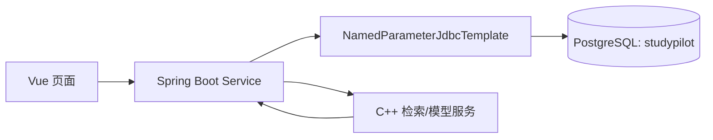

# StudyPilot 数据库实现说明

这份说明对应 `DB-001`，帮助成员理解代码中的 SQL、JDBC 配置和测试方式。它描述的是目标架构的持久化基础，不代表三个业务模块已经完成接口和页面。

## 1. 数据库在系统中的位置

PostgreSQL 保存长期、需要追溯的业务事实：项目、资料解析结果、问答引用、题目、作答和诊断结果。原始 PDF 仍留在本地文件系统，C++ 服务只处理检索与模型推理；Java 负责把这两类结果与 PostgreSQL 中的业务记录关联。



项目（`projects`）是最高数据边界。资料、会话、真题、试卷、掌握度都直接或间接归属于一个项目，因此课程之间不会混用资料或统计结果。

## 2. SQL 文件及执行顺序

| 文件 | 作用 | 关键表 |
| --- | --- | --- |
| `00-schema.sql` | 创建私有 Schema | `studypilot` |
| `10-common.sql` | 项目与模型运行审计 | `projects`、`model_runs` |
| `20-document.sql` | 资料解析和索引状态 | `documents`、`document_pages`、`document_chunks`、`document_index_status` |
| `30-qa.sql` | 溯源问答 | `qa_sessions`、`qa_messages`、`qa_retrieval_records`、`qa_citations` |
| `40-exam.sql` | 真题分析与组卷 | `source_questions`、知识点、蓝图、模拟试卷与校验记录 |
| `50-assessment.sql` | 作答与诊断 | 作答、答案、评分细节、错题、掌握度、推荐和任务 |
| `90-indexes.sql` | 查询性能 | 项目、外键、排序和高频筛选索引 |

七份文件全部使用 `CREATE ... IF NOT EXISTS`。首次部署按顺序执行；后续修改已有表时新增带日期的 `ALTER TABLE` 迁移脚本，不能修改旧建表脚本后假设线上结构会自动变化。

## 3. 三个功能模块如何使用数据

**资料问答**：上传资料后，`documents` 保存文件元数据，`document_pages` 保存页级文本，`document_chunks` 保存检索粒度，`document_index_status` 记录是否已建立索引。回答时，`qa_retrieval_records` 记录实际检索命中的片段；`qa_citations` 保存文档名、页码和原文快照，所以即使资料后来删除，旧回答的引用仍可解释。

**考频与模拟考**：`source_questions` 保存从真题中抽取的题目，选项和知识点独立存储，便于统计知识点出现次数。`exam_blueprints` 保存组卷要求，`mock_exams` 与 `mock_exam_items` 保存已经冻结的试卷内容，`question_validation_records` 保存程序对模型生成结果的校验证据。

**答题评测**：`exam_attempts` 表示一次独立作答，`attempt_answers` 保存每一道题的答案与评分状态。规则评分或模型评分的依据进入 `grading_details`；错误题进一步形成 `wrong_questions`，再汇总为 `mastery_records` 和 `recommendation_records`。这样推荐结论可以回溯到具体作答，而不是只保留模型的一段自然语言结论。

## 4. JDBC 访问边界

`PostgreSqlJdbcConfig` 只有在三个数据库环境变量齐全时才创建 Hikari 数据源和 `NamedParameterJdbcTemplate`。没有配置数据库的同学仍能启动 Gateway 和接口骨架，减少本地开发门槛；部署环境一旦配置 URL，缺失账号或密码会立刻给出明确错误。

Repository 使用命名参数，例如 `JdbcProjectRepository` 的 `:projectId`。这避免字符串拼接 SQL，也让 SQL 中的查询条件和参数名称一一对应。Controller 不能直接使用 Repository，后续功能必须由本模块 Service 或 Workflow 编排事务和业务规则。

## 5. 验证方法

`PostgreSqlSchemaIntegrationTest` 使用测试范围的 Embedded PostgreSQL。测试会临时启动 Windows PostgreSQL、连续执行两遍全部 DDL，之后写入项目、资料、页和分块，并验证：

- 24 张目标表均属于 `studypilot` Schema；
- `mock_exam_items.options` 是 PostgreSQL 原生 `JSONB`；
- 项目删除会按外键规则清除其资料；
- 第二遍执行 DDL 不报错，保证初始化可重复。

运行命令：

```powershell
cd backend
.\mvnw.cmd clean test
```

连接真实测试库时再运行：

```powershell
$env:STUDYPILOT_DB_URL = 'jdbc:postgresql://127.0.0.1:5432/studypilot_test'
$env:STUDYPILOT_DB_USERNAME = '本地测试账号'
$env:STUDYPILOT_DB_PASSWORD = '本地测试密码'
powershell -ExecutionPolicy Bypass -File .\scripts\verify-schema.ps1
```

不要把示例中的值替换为真实地址或密码后提交。真实 Supabase 联调属于后续集成任务，不能用它替代隔离测试。
