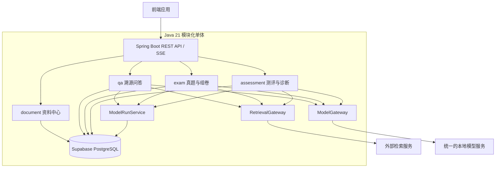

# StudyPilot 后端框架设计

## 1. 文档目的

本文档定义 StudyPilot 后端绿地工程的统一骨架，供后续开发 Agent 创建可编译工程，并供三名成员在相同结构中分别开发资料知识库与溯源问答、真题分析与模拟题生成、智能测评与薄弱点诊断三个业务模块。

本文档是后端骨架的架构基线，不包含完整业务实现。`StudyPilot/backend` 中的文件仅作需求参考，不迁移其中的 Java 类、配置、SQL、构建产物或本机路径；后续如需删除该参考目录，应单独确认删除范围后执行。

## 2. 已确认的项目边界

### 2.1 后端负责

- 提供 REST API 与问答流式响应接口；
- 校验前端请求并编排业务流程；
- 通过 PostgreSQL JDBC 访问 Supabase 在线数据库；
- 定义资料、检索、问答、组卷、测评等领域模型；
- 通过统一 Gateway 接口调用检索服务和单个本地模型；
- 使用模块专属提示词、推理参数、RAG流程和结果校验实现任务适配；
- 处理数据库事务、并发限制、异常转换、运行记录和测试。

### 2.2 后端骨架不负责

- Vue页面、组件和前端工程；
- C++检索算法、HTTP服务和进程管理；
- llama.cpp编译、模型下载、量化、加载和推理优化；
- Supabase Auth、用户注册、登录、JWT和角色权限；
- Supabase Storage和前端直连Supabase Data API；
- 旧后端代码迁移；
- 完整业务表和全部业务接口实现。

项目按本地个人使用场景设计，不设置用户表和 `user_id` 字段。

## 3. 技术基线

| 类别 | 选型 |
| --- | --- |
| JDK | Java 21 |
| 构建工具 | Maven |
| 后端框架 | Spring Boot 3.5.0 |
| Web | Spring Web MVC |
| 请求校验 | Jakarta Bean Validation |
| 数据访问 | Spring JDBC、`NamedParameterJdbcTemplate` |
| 数据库 | Supabase 托管的 PostgreSQL |
| 连接池 | HikariCP（Spring Boot默认） |
| JSON | Jackson |
| PDF解析 | Apache PDFBox 3.0.5 |
| 测试 | JUnit 5、Mockito、Spring Boot Test |

骨架不引入 JPA、MyBatis、Spring Security、WebFlux、Lombok、Flyway、H2 或运行时 Mock Profile。

## 4. 工程组织方案

采用单个 Maven 工程的模块化单体。所有模块在一个 Spring Boot 进程中运行，但代码按业务能力隔离。

选择该方案的原因：

- 三名成员只需要维护和启动一个后端工程；
- 每个人主要修改自己的业务包和SQL文件；
- 公共DTO、异常和Gateway只保留一套；
- 相比微服务和Maven多模块，部署和最终联调成本更低；
- 相比全局技术分层，业务边界更清楚，集中整合时更少发生文件覆盖。

## 5. 总体架构



业务模块只依赖 Gateway 接口，不管理C++服务、模型进程或端口。骨架只定义后端侧契约，不实现外部服务。

## 6. 目标目录结构

当前项目根目录中的 `后端框架设计.md` 是架构基线原件。开发Agent创建新工程时，将其复制到 `backend/docs/后端框架设计.md`，便于骨架独立分发。

```text
backend/
├── .mvn/
│   └── wrapper/
├── mvnw
├── mvnw.cmd
├── pom.xml
├── README.md
├── scripts/
│   └── build.ps1
├── docs/
│   └── 后端框架设计.md
└── src/
    ├── main/
    │   ├── java/cn/studypilot/
    │   │   ├── Application.java
    │   │   ├── common/
    │   │   │   ├── config/
    │   │   │   ├── exception/
    │   │   │   ├── response/
    │   │   │   └── validation/
    │   │   ├── document/
    │   │   │   ├── controller/
    │   │   │   ├── dto/
    │   │   │   ├── model/
    │   │   │   ├── repository/
    │   │   │   └── service/
    │   │   ├── model/
    │   │   │   ├── gateway/
    │   │   │   ├── dto/
    │   │   │   ├── config/
    │   │   │   ├── repository/
    │   │   │   └── service/
    │   │   ├── retrieval/
    │   │   │   ├── gateway/
    │   │   │   └── dto/
    │   │   ├── qa/
    │   │   │   ├── controller/
    │   │   │   ├── dto/
    │   │   │   ├── model/
    │   │   │   ├── repository/
    │   │   │   ├── service/
    │   │   │   ├── algorithm/
    │   │   │   ├── workflow/
    │   │   │   └── validation/
    │   │   ├── exam/
    │   │   │   ├── controller/
    │   │   │   ├── dto/
    │   │   │   ├── model/
    │   │   │   ├── repository/
    │   │   │   ├── service/
    │   │   │   ├── algorithm/
    │   │   │   ├── workflow/
    │   │   │   └── validation/
    │   │   └── assessment/
    │   │       ├── controller/
    │   │       ├── dto/
    │   │       ├── model/
    │   │       ├── repository/
    │   │       ├── service/
    │   │       ├── algorithm/
    │   │       ├── workflow/
    │   │       └── validation/
    │   └── resources/
    │       ├── application.yml
    │       └── db/schema/
    │           ├── 00-schema.sql
    │           ├── 10-common.sql
    │           ├── 20-document.sql
    │           ├── 30-qa.sql
    │           ├── 40-exam.sql
    │           ├── 50-assessment.sql
    │           └── 90-indexes.sql
    └── test/
        └── java/cn/studypilot/
            ├── common/
            ├── document/
            ├── model/
            ├── retrieval/
            ├── qa/
            ├── exam/
            └── assessment/
```

Java源码只能放在 `src/main/java/cn/studypilot` 及其子包中，对应的Java根包名固定为 `cn.studypilot`；配置与SQL只能放在 `src/main/resources`；测试代码只能放在 `src/test/java/cn/studypilot`。

## 7. 包职责与依赖规则

### 7.1 `common`

仅存放所有模块共同需要且与具体业务无关的代码：

- 统一响应和分页结构；
- 错误码、业务异常和全局异常处理；
- 请求ID、时间格式和基础配置；
- 可复用的纯校验工具。

禁止把问答、组卷或测评业务逻辑放入 `common`。

### 7.2 `document`

负责共享资料中心，包括资料元数据、PDF校验、文本提取、分页、分块元数据和索引状态。PDF原文件保存在本地文件目录，不以二进制形式写入PostgreSQL。

资料类型至少支持：

- `TEXTBOOK`：教材；
- `LECTURE`：讲义；
- `KNOWLEDGE`：知识点资料；
- `PAST_EXAM`：历年真题；
- `REFERENCE_ANSWER`：参考答案。

### 7.3 `model`

定义统一模型调用协议、任务参数，以及模型运行元数据的保存服务。`ModelGateway` 不直接访问数据库；业务工作流在调用结束后通过 `ModelRunService` 保存运行记录。该包不包含业务模块的RAG流程与结果校验。

### 7.4 `retrieval`

只定义检索服务调用协议。检索算法和C++实现不在后端骨架范围内。

### 7.5 `qa`

负责资料知识库与溯源问答。该模块拥有自己的Controller、Service、Repository、工作流、提示词组织和引用校验。

### 7.6 `exam`

负责真题识别、题型白名单、统计分析、组卷蓝图、结构化题目生成和规则校验。

### 7.7 `assessment`

负责在线作答、单选题确定性判分、简答题模型辅助评分、错题、掌握度、巩固推荐和短期复习建议。

### 7.8 模块依赖规则

允许：

```text
Controller → 本模块 Service / Workflow
Service / Workflow → 本模块 Repository
Service / Workflow → ModelGateway / RetrievalGateway
Service / Workflow → ModelRunService
业务模块 → document 对外查询服务
所有模块 → common
```

禁止：

```text
Controller → Repository
一个业务模块 → 另一个业务模块的 Repository
Repository → ModelGateway
ModelGateway → qa / exam / assessment
common → 任一业务模块
```

跨模块读取必须通过对方公开的查询Service或只读DTO完成。

## 8. Maven依赖范围

后续开发Agent创建的 `pom.xml` 应只包含骨架所需依赖：

```xml
<dependencies>
    <dependency>
        <groupId>org.springframework.boot</groupId>
        <artifactId>spring-boot-starter-web</artifactId>
    </dependency>
    <dependency>
        <groupId>org.springframework.boot</groupId>
        <artifactId>spring-boot-starter-validation</artifactId>
    </dependency>
    <dependency>
        <groupId>org.springframework.boot</groupId>
        <artifactId>spring-boot-starter-jdbc</artifactId>
    </dependency>
    <dependency>
        <groupId>org.postgresql</groupId>
        <artifactId>postgresql</artifactId>
        <scope>runtime</scope>
    </dependency>
    <dependency>
        <groupId>org.apache.pdfbox</groupId>
        <artifactId>pdfbox</artifactId>
        <version>3.0.5</version>
    </dependency>
    <dependency>
        <groupId>org.springframework.boot</groupId>
        <artifactId>spring-boot-starter-test</artifactId>
        <scope>test</scope>
    </dependency>
</dependencies>
```

Spring Boot父工程负责管理Spring和PostgreSQL驱动版本。除PDFBox外，不单独锁定由Spring Boot管理的依赖版本。

### 8.1 不依赖IDE的构建方式

工程不得依赖IDEA、Eclipse、VS Code或其他IDE才能创建、编译、测试和运行。后续开发Agent应能从一个空的 `backend` 目录开始，仅通过文件创建和命令行完成骨架搭建，不复制参考后端源码，也不把 `.idea/`、`*.iml` 等IDE专属文件作为工程运行条件。

最终骨架必须提交完整的Maven Wrapper：

```text
.mvn/wrapper/
mvnw
mvnw.cmd
```

因此，拿到完整骨架的成员无需全局安装Maven。其电脑只需具备：

- JDK 21；
- Windows PowerShell或命令提示符；
- 首次构建时可用于下载Maven发行包和项目依赖的网络连接。

Windows下的标准命令为：

```powershell
.\mvnw.cmd clean test
.\mvnw.cmd spring-boot:run
```

macOS或Linux下可使用：

```bash
./mvnw clean test
./mvnw spring-boot:run
```

Maven Wrapper不能替代JDK。若未安装Java 21，脚本应立即给出清晰错误，而不是自动修改系统环境或静默改用其他Java版本。

### 8.2 Windows构建脚本

骨架应提供 `scripts/build.ps1`，用于降低命令行构建门槛。脚本职责限定为：

1. 定位脚本所在工程的根目录，不依赖调用者当前工作目录；
2. 检查 `java` 命令是否存在且主版本为21；
3. 检查根目录是否存在 `mvnw.cmd`；
4. 调用 `mvnw.cmd clean test`；
5. 原样返回Maven退出码，使失败能够被命令行和自动化工具识别。

脚本不得写入数据库密码、自动安装JDK、修改系统环境变量、跳过测试，或要求Supabase、检索服务和本地模型已经启动。纯骨架测试必须能够在这些外部服务均未启动时执行。

标准用法为：

```powershell
powershell -ExecutionPolicy Bypass -File .\scripts\build.ps1
```

## 9. API与DTO规范

### 9.1 路径

- 所有普通接口使用 `/api/v1` 前缀；
- 资料接口使用 `/api/v1/documents`；
- 问答接口使用 `/api/v1/qa`；
- 真题与组卷接口使用 `/api/v1/exams`；
- 测评接口使用 `/api/v1/assessments`；
- 全局健康检查使用 `/api/v1/health`。

### 9.2 DTO

- 请求和响应使用Java `record`；
- Controller不得直接返回数据库模型；
- 时间使用ISO 8601字符串，Java类型使用 `Instant` 或 `OffsetDateTime`；
- 枚举在JSON中使用稳定的大写英文值；
- 分页请求统一使用 `page`、`size`；
- 分页响应统一返回 `items`、`page`、`size`、`total`。

建议公共响应：

```java
public record ApiResponse<T>(T data, String requestId) {}
```

流式问答使用SSE事件，不套普通 `ApiResponse`。

### 9.3 参数校验

Controller使用 `@Valid`、`@NotBlank`、`@NotNull`、`@Size` 等完成格式校验；Service或Validator完成业务规则校验。AI输出不能只依赖反序列化成功，必须继续执行模块专属规则校验。

## 10. 异常规范

公共异常组件至少包括：

```text
ErrorCode
BusinessException
ResourceNotFoundException
ConflictException
ExternalServiceException
ModelOutputValidationException
GlobalExceptionHandler
```

统一错误响应：

```json
{
  "code": "EXAM_OUTPUT_INVALID",
  "message": "模型生成的题目未通过题型白名单校验",
  "requestId": "请求标识",
  "timestamp": "ISO-8601时间"
}
```

HTTP状态映射：

| 状态 | 场景 |
| --- | --- |
| 400 | 请求格式或字段校验失败 |
| 404 | 资料、试卷或作答记录不存在 |
| 409 | 重复文件、重复提交或状态冲突 |
| 422 | 请求合法但业务规则或模型输出不合格 |
| 502 | 外部检索或模型服务返回无效响应 |
| 503 | 外部服务不可用或任务过载 |
| 500 | 未预期的后端错误 |

日志可以记录请求ID、业务ID、耗时和错误码，但不得记录数据库密码、完整模型上下文或敏感资料全文。

## 11. Supabase PostgreSQL设计

数据库地址：[StudyPilot | mengyang01's Org --My own project | Supabase](https://supabase.com/dashboard/project/fijqkqvrdqmajrrqmgyj)

### 11.1 连接方式

Spring Boot只通过PostgreSQL JDBC连接Supabase，不使用前端SDK或Data API。

AI可以使用的数据库建设与连接的提示词为：

````
1. Connection string
Copy the connection details for your database.
Details:
Shared pooler
If your database password contains special characters, percent-encode them in the connection string.
Connection parameters
host:aws-0-ap-southeast-2.pooler.supabase.com
port:5432
database:postgres
user:postgres.fijqkqvrdqmajrrqmgyj
Code:
File: Code
```
jdbc:postgresql://aws-0-ap-southeast-2.pooler.supabase.com:5432/postgres?user=postgres.fijqkqvrdqmajrrqmgyj&password=9EfLRCH1CKL9WjmP
```

2. Install Agent Skills (optional)
Agent Skills give AI coding tools ready-made instructions, scripts, and resources for working with Supabase more accurately and efficiently.
Code:
File: Code
```
npx skills add supabase/agent-skills
```
````

连接策略：

- 最终电脑支持IPv6时使用Direct Connection；
- IPv4网络使用Supavisor Session Pooler的5432端口；
- 不使用面向Serverless的Transaction Pooler 6543端口；
- 连接启用SSL；
- 实际主机、用户名和密码从Supabase控制台获取。

`application.yml` 只引用环境变量：

```yaml
spring:
  datasource:
    url: ${SUPABASE_DB_URL}
    username: ${SUPABASE_DB_USERNAME}
    password: ${SUPABASE_DB_PASSWORD}
    driver-class-name: org.postgresql.Driver
    hikari:
      maximum-pool-size: 5
      minimum-idle: 1
      connection-timeout: 10000
```

JDBC URL应包含SSL和当前Schema参数，例如：

```text
jdbc:postgresql://<host>:5432/postgres?sslmode=require&currentSchema=studypilot
```

项目文件中不得出现真实项目ID、数据库主机、用户名、密码、Service Role Key或其他密钥。

### 11.2 Schema

业务表统一放在 `studypilot` Schema，不放在默认对Data API暴露的 `public` Schema，也不把 `studypilot` 添加到Supabase Exposed Schemas。

`00-schema.sql` 至少包含：

```sql
CREATE SCHEMA IF NOT EXISTS studypilot;
SET search_path TO studypilot, public;
```

### 11.3 PostgreSQL字段规范

- 表名和列名使用小写 `snake_case`；
- 主键使用 `BIGINT GENERATED BY DEFAULT AS IDENTITY`；
- 时间使用 `TIMESTAMPTZ`；
- 长文本使用 `TEXT`；
- 结构化模型参数和运行结果可使用 `JSONB`；
- 布尔值使用 `BOOLEAN`；
- 金额以外的比例和分数使用有明确精度的 `NUMERIC`；
- 每张业务表包含 `created_at`，可变记录包含 `updated_at`；
- 外键必须明确删除策略；
- 对外键、查询条件、排序字段和唯一业务键建立必要索引；
- 不使用MySQL反引号、`AUTO_INCREMENT`、`DATETIME`、`MEDIUMTEXT`、`TINYINT(1)` 或 `ON DUPLICATE KEY UPDATE`。

### 11.4 SQL脚本组织

项目不使用Flyway。SQL文件按以下固定顺序在Supabase SQL Editor或 `psql` 中执行：

1. `00-schema.sql`：创建Schema；
2. `10-common.sql`：公共模型运行记录；
3. `20-document.sql`：资料、页面、文本块和索引状态；
4. `30-qa.sql`：问答会话、消息、检索记录和引用；
5. `40-exam.sql`：真题、知识点、蓝图和模拟试卷；
6. `50-assessment.sql`：作答、评分、错题、掌握度和推荐；
7. `90-indexes.sql`：跨表或集中管理的补充索引。

各文件中的建表语句应使用 `CREATE TABLE IF NOT EXISTS`。正式数据存在后，不得通过覆盖旧SQL假设数据库会自动升级；表结构调整必须额外编写明确的 `ALTER TABLE` 脚本并在执行前备份。

### 11.5 表边界

骨架只规定表的归属，不提前锁死完整字段。

| SQL文件 | 建议表 |
| --- | --- |
| `10-common.sql` | `model_runs` |
| `20-document.sql` | `documents`、`document_pages`、`document_chunks`、`document_index_status` |
| `30-qa.sql` | `qa_sessions`、`qa_messages`、`qa_retrieval_records`、`qa_citations` |
| `40-exam.sql` | `source_questions`、`question_options`、`question_knowledge_points`、`exam_blueprints`、`mock_exams`、`mock_exam_items`、`question_validation_records` |
| `50-assessment.sql` | `exam_attempts`、`attempt_answers`、`grading_details`、`wrong_questions`、`mastery_records`、`recommendation_records`、`study_tasks` |

## 12. 统一模型调用设计

项目只部署一个本地模型。三个模块共享 `ModelGateway`，但各自拥有业务工作流。

### 12.1 职责划分

`ModelGateway` 负责：

- 发送统一模型请求；
- 接收普通或流式响应；
- 设置连接和读取超时；
- 将网络错误转换为统一外部服务异常；
- 返回模型原始输出和运行元数据。

`ModelGateway` 不负责：

- 检索资料；
- 组装模块提示词；
- 决定问答、组卷或评分业务步骤；
- 校验引用、题型、分数和推荐结果；
- 保存业务实体或模型运行记录；
- 开启数据库事务。

业务实体的编排与保存分别属于 `qa.workflow`、`exam.workflow` 和 `assessment.workflow`；模型调用结束后，各工作流通过公共的 `ModelRunService` 记录模型名称、任务类型、参数摘要、耗时、结束原因和成功状态。运行记录不得包含完整提示词、资料全文或数据库密钥。

### 12.2 任务类型

骨架定义稳定的任务类型：

```text
QA_ANSWER
QA_SUMMARIZE
QA_COMPARE
EXAM_EXTRACT_QUESTION
EXAM_GENERATE_QUESTION
EXAM_GENERATE_EXPLANATION
ASSESS_SHORT_ANSWER
ASSESS_ERROR_ANALYSIS
ASSESS_REVIEW_ADVICE
```

`ModelTaskConfigRegistry` 根据任务类型提供温度、最大输出长度、超时和是否要求JSON等推理参数。所有任务仍发送给同一个模型，不存在模型路由和模型切换。

### 12.3 Gateway契约

建议接口：

```java
public interface ModelGateway {
    ModelResponse complete(ModelRequest request);
    void stream(ModelRequest request, ModelStreamListener listener);
}
```

`ModelRequest` 至少包含：

```text
taskType
systemPrompt
userPrompt
context
generationOptions
requestId
```

`ModelResponse` 至少包含：

```text
content
finishReason
modelName
inputTokenCount
outputTokenCount
latencyMs
```

骨架只创建接口、枚举和DTO，不提供运行时Mock，也不在启动时探测本地模型。真实HTTP实现可以在外部服务协议确定后补充。

### 12.4 三个业务工作流

溯源问答：

```text
检索资料 → 整理证据 → 证据充分性判断 → 组装提示词
→ 调用模型 → 引用校验 → 保存问答与引用 → 返回结果
```

模拟组卷：

```text
读取真题统计 → 生成组卷蓝图 → 检索参考资料 → 组装提示词
→ 调用模型 → JSON解析 → 白名单与约束校验 → 保存试卷
```

智能测评：

```text
读取答案与评分点 → 客观题规则判分 → 检索资料依据
→ 简答题模型评分 → 分数与理由校验 → 更新掌握度与推荐
```

AI输出校验失败最多允许一次带错误原因的修正请求；第二次仍失败则终止并返回明确错误，禁止无限重试。

## 13. 统一检索接口

建议接口：

```java
public interface RetrievalGateway {
    List<RetrievalHit> retrieve(RetrievalRequest request);
}
```

`RetrievalRequest` 至少包含：

```text
query
documentIds
materialTypes
topK
requestId
```

`RetrievalHit` 至少包含：

```text
chunkId
documentId
documentName
pageNumber
content
score
```

后端通过 `chunkId`、`documentId` 和页码核验引用。业务模块不得自行拼接C++服务地址或解析不统一的检索响应。

## 14. 模块入口

轻量骨架只建立模块入口和契约，不实现完整业务。

建议入口：

- `DocumentController`：映射 `/api/v1/documents`；
- `QaController`：映射 `/api/v1/qa`；
- `ExamController`：映射 `/api/v1/exams`；
- `AssessmentController`：映射 `/api/v1/assessments`；
- `HealthController`：映射 `/api/v1/health`。

初始Controller只提供能够证明模块被Spring扫描的最小状态接口，不创建伪造业务数据，不调用尚未完成的外部服务。

## 15. 事务和外部调用原则

- `@Transactional` 放在Service层；
- Controller和Gateway不开启数据库事务；
- 调用模型或检索服务时不得长时间占用数据库事务；
- 标准流程为“读取必要数据 → 结束读取 → 调外部服务 → 程序校验 → 开启短事务保存”；
- 模型输出、试卷、评分和掌握度更新需要在校验通过后保存；
- 组卷、提交作答等接口使用业务状态和唯一约束防止重复提交；
- 跨本地文件、外部索引和PostgreSQL的操作采用状态字段与补偿处理，不假设分布式事务。

## 16. 测试骨架

不提供运行时Mock Profile，但允许在单元测试中使用Mockito替代Gateway接口。

骨架至少包含：

- 普通DTO和异常处理单元测试位置；
- `qa`、`exam`、`assessment` 模块测试包；
- 算法类纯单元测试约定；
- Gateway契约测试位置；
- 需要Supabase测试Schema时使用独立环境变量的说明。

测试不得直接修改正式演示数据。数据库集成测试使用单独的 `studypilot_test` Schema或独立Supabase测试项目；未配置测试数据库时，只运行不依赖数据库的单元测试。

## 17. 无版本管理条件下的整合规则

三名成员最初获得相同的完整骨架副本。后续各自只提交本人负责的增量目录和说明，不使用整个工程相互覆盖。

推荐所有权：

| 范围 | 维护方式 |
| --- | --- |
| `qa/`、`30-qa.sql` | 问答模块负责人 |
| `exam/`、`40-exam.sql` | 组卷模块负责人 |
| `assessment/`、`50-assessment.sql` | 测评模块负责人 |
| `common/`、`model/`、`retrieval/`、`pom.xml`、`application.yml` | 集中整合时统一修改 |
| `document/`、`20-document.sql` | 由问答模块负责人主维护，其他成员通过公开Service使用 |

每名成员交付时同时提供：

- 新增和修改的文件清单；
- 模块SQL文件；
- API路径和请求响应样例；
- 新增依赖清单；
- 配置项清单；
- 测试命令与结果；
- 与公共接口不一致的地方。

集中整合时只复制明确归属的模块目录，公共文件逐项合并，禁止直接覆盖最终电脑上的整个 `backend` 目录。

## 18. 后续开发Agent的实施顺序

开发Agent应按以下顺序创建骨架：

1. 在明确的新 `backend` 目录创建Maven工程，不复制参考后端源码；
2. 创建Java 21和Spring Boot 3.5.0的 `pom.xml`；
3. 加入完整Maven Wrapper以及 `scripts/build.ps1`；
4. 创建 `Application.java` 和全部包结构；
5. 创建公共响应、分页、错误码、异常和全局异常处理；
6. 创建Supabase PostgreSQL配置占位符；
7. 创建模块化SQL目录及安全的Schema初始化脚本；
8. 创建 `ModelGateway`、`RetrievalGateway`、任务枚举和公共DTO；
9. 创建三个模块的Controller入口与工作流接口；
10. 创建最小单元测试；
11. 分别通过Maven Wrapper和Windows构建脚本执行测试，确认工程不包含旧源码和真实密钥。

开发Agent不得提前实现前端、C++服务、完整业务流程或模型微调。

## 19. 骨架验收标准

骨架满足以下条件后可分发给三名成员：

1. `mvn clean test` 在不运行外部模型和C++服务的情况下完成编译与纯单元测试；
2. 所有Java文件位于 `src/main/java/cn/studypilot`；
3. 三个业务模块和公共模块的边界与本文档一致；
4. `pom.xml` 使用PostgreSQL驱动，不包含MySQL、H2、JPA、MyBatis或Flyway；
5. 数据库配置只引用环境变量；
6. SQL使用PostgreSQL语法并位于模块化目录；
7. 业务表位于未暴露给Data API的 `studypilot` Schema；
8. 项目不存在登录、用户、角色和JWT代码；
9. 项目不存在运行时Mock Gateway；
10. Gateway不包含业务模块的提示词、RAG编排和结果校验；
11. 旧参考代码和本机绝对路径没有进入新骨架；
12. README说明Maven Wrapper命令、环境变量和模块开发边界；
13. 未安装全局Maven时，`mvnw.cmd clean test` 能够完成构建；
14. `scripts/build.ps1` 能检查Java 21并返回真实构建结果；
15. 工程不依赖IDE配置文件。

## 20. 后续不兼容变更原则

骨架分发后，下列内容视为公共契约，修改时需要三人共同知晓：

- Java包根路径；
- API版本前缀；
- 公共响应和错误格式；
- `ModelGateway` 与 `RetrievalGateway` 方法签名；
- `ModelTaskType` 枚举；
- PostgreSQL Schema名称；
- 资料类型枚举；
- 公共表和跨模块外键。

业务模块内部类、提示词、算法和专属表字段由对应负责人自行设计，只要不破坏公共契约。

## 21. 参考资料

- 项目需求：[需求规划.md](./需求规划.md)
- Supabase数据库连接：<https://supabase.com/docs/guides/database/connecting-to-postgres>
- Supabase自定义Schema：<https://supabase.com/docs/guides/api/using-custom-schemas>
- Supabase数据安全：<https://supabase.com/docs/guides/database/secure-data>

