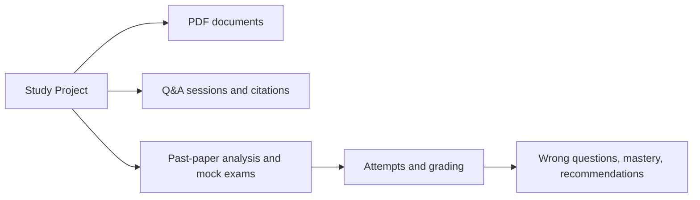
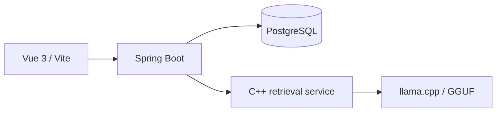

# 产品架构与当前实现

本文描述当前分支可以运行和验证的 StudyPilot 版本。它区分已经实现的能力与后续可扩展方向，避免把需求讨论稿当作已交付功能。

## 1. 用户能完成的闭环

```text
创建学习项目
→ 上传文字型 PDF（教材、讲义、知识点、历年真题）
→ 建立项目内检索索引
→ 针对项目资料发起溯源问答
→ 分析历年真题的知识点频次
→ 生成一份 2 单选 + 2 简答的模拟卷
→ 在线作答并提交
→ 查看客观题得分、简答题反馈与总分
```

系统按单机个人使用设计，不包含登录、账号、权限、云端同步、OCR 或图像题理解。

## 2. 项目隔离

项目是所有业务数据的边界。创建项目时只提交 `name` 和可选 `description`，后端返回项目 ID；前端之后将该 ID 放入页面地址和每次 API 请求。



资料、检索、问答、试卷、作答和评分查询都带有 `projectId`。后端服务会校验试卷、资料或问答会话是否属于当前项目；跨项目 ID 不会返回另一项目的数据。项目级删除接口尚未提供，因此文档不承诺前端可执行的项目删除或恢复功能。

## 3. 资料与问答

当前仅支持可以由 PDFBox 直接提取文字的 PDF。上传时选择资料类型：`TEXTBOOK`、`LECTURE`、`KNOWLEDGE`、`PAST_EXAM` 或 `REFERENCE_ANSWER`。

Java 后端保存文件和页级文本，再调用 C++ 服务建立按文档 ID 区分的索引。问答只检索当前项目中已准备好的知识资料，不把历年真题作为普通问答依据。模型回答保存引用快照，包括资料名、页码和原文片段；当检索依据不足时返回明确的资料不足状态，而不是伪造来源。

当前问答页面支持连续提问。服务端返回并复用 `sessionId`；会话列表、命名和历史浏览不是当前前端交付范围。

## 4. 真题分析与模拟卷

真题分析页面接受一个历年真题资料编号。后端从文字中划分题目、提取并归一知识点，再按项目统计频次。无法由文字完整表达的内容不应进入统计。

模拟卷由项目内知识资料和真题统计共同驱动。为了保证生成结果可验证，当前版本固定要求 2 道单项选择题与 2 道简答题。后端对模型 JSON 进行题数、字段、选项、答案、资料来源、重复度和知识点覆盖校验；校验失败不会写入试卷。

## 5. 在线作答与测评

用户从模拟卷预览进入作答页。每次点击“开始本次作答”都会创建独立 `attempt`，同一试卷的多次练习不会覆盖。

- 单项选择题按标准答案进行规则判分；
- 简答题请求本地模型返回严格的 `score` 与 `feedback` JSON，后端验证分数范围和文本内容；
- 提交必须覆盖本次试卷中的所有题目；
- 答案、评分依据、错题、知识点掌握度和建议记录写入 PostgreSQL；
- 当前页面显示总分及逐题反馈。历史作答列表和完整报告页可在此数据模型基础上继续增加。

## 6. 页面与接口映射

| 页面 | 地址 | 核心接口 |
| --- | --- | --- |
| 创建项目 | `/projects` | `POST /api/v1/projects` |
| 资料管理 | `/projects/:projectId/resources` | `GET/POST/DELETE /api/v1/documents` |
| 知识问答 | `/projects/:projectId/qa` | `POST /api/v1/qa` |
| 真题分析与模拟卷 | `/projects/:projectId/exams` | `POST/GET /api/v1/exams/...` |
| 在线作答 | `/projects/:projectId/assessment?examId=:examId` | `POST /api/v1/assessments/attempts`、`POST .../submit` |

健康检查使用 `GET /api/v1/health`；依赖状态使用 `GET /api/v1/health/dependencies`。完整错误码和 Gateway 边界见 [接口契约索引](../关键记录/接口契约索引.md)。

## 7. 技术结构



前端不直连数据库、模型或 C++ 服务。Java 通过 `RetrievalGateway` 和 `ModelGateway` 访问内部 AI 服务；C++ 负责检索、并发队列和到 llama.cpp 的请求转发。详细运行方式见 [部署与运行指南](../部署与运行指南.md)。

## 8. 已知边界与演进方向

当前版本的重点是可验证的本地闭环，因此没有实现项目列表、项目删除 UI、会话管理 UI、答题草稿、历史报告页、OCR 和多用户能力。这些能力不影响当前三模块演示，但应在新增功能时同时补充接口、数据库迁移、前端页面和自动化测试。
