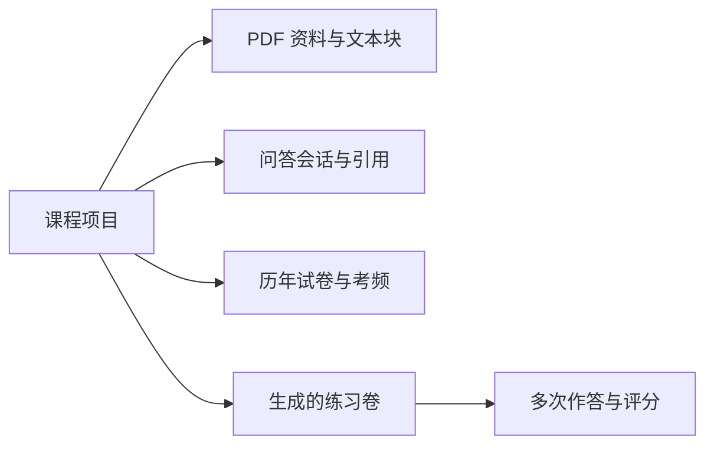
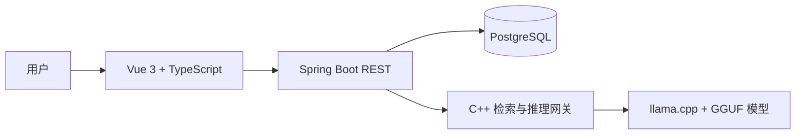

# 产品架构与当前实现

本文只描述当前分支已经实现并能够演示的 StudyPilot 版本。需求讨论稿和后续扩展不作为已完成功能。

## 1. 当前产品闭环

```text
创建课程
→ 在问答页上传文字型 PDF
→ 建立当前课程的检索索引
→ 进行知识问答并查看引用
→ 上传历年试卷并分析知识点考频
→ 输入要求或直接生成一套练习
→ 在线作答并提交测评
→ 查看总分和逐题反馈
→ 重新作答或删除历史练习
```

系统面向单机个人学习场景，以课程项目作为数据边界。当前没有登录、账号、权限、云端同步、OCR 和图片题理解。

## 2. 用户界面结构

系统采用接近开发工具工作区的布局。左侧显示课程列表、归档课程和当前课程功能，右侧显示正在使用的业务页面。

当前三个主功能入口为：

1. **知识问答**：上传和管理课程 PDF，完成资料增强问答并保留问答历史。
2. **智能组卷**：按自然语言要求生成练习，查看历史练习并进入在线作答和测评。
3. **考频分析**：选择已上传的历年试卷，完成题目切分、知识点归一和频次统计。

在线作答与测评由智能组卷进入，不单独占用一级导航。课程支持创建、切换、归档和恢复；归档只隐藏课程入口，不删除课程数据。

## 3. 课程隔离

课程项目是资料、问答、试卷、考频和作答记录的共同边界。



前端地址和业务请求都携带 `projectId`。后端读取资料、会话、试卷和作答记录时再次校验数据归属，不能通过修改地址读取另一课程的数据。

## 4. 课程资料与知识问答

资料入口位于知识问答页面右侧。用户上传不超过 25 MB、能够直接提取文字的 PDF，系统自动识别常规学习资料或历年试卷。Java 使用 PDFBox 提取分页文字、生成文本块并保存，随后调用 C++ 服务建立检索索引。

提问时，系统优先检索当前课程中已经就绪的学习资料。模型只接收通过项目和索引白名单校验的片段；页面中的资料名、页码和原文摘录由服务端检索快照生成，不采用模型自行编写的引用。

当前问答行为如下：

- 命中相关资料时，模型根据资料回答并显示真实引用；
- 没有上传资料或没有命中相关片段时，模型按通用知识直接回答，引用列表为空；
- 问答消息保存到 PostgreSQL，切换模块或刷新页面后可以恢复当前课程的历史；
- 模块切换不会主动取消正在执行的问答任务。

主要接口：

| 方法 | 地址 | 用途 |
| --- | --- | --- |
| `POST` | `/api/v1/documents` | 上传并处理 PDF |
| `GET` | `/api/v1/documents?projectId=...` | 查询当前课程资料 |
| `DELETE` | `/api/v1/documents/{id}?projectId=...` | 删除资料、文件和检索索引 |
| `POST` | `/api/v1/qa` | 提交问题 |
| `GET` | `/api/v1/qa/history?projectId=...` | 恢复当前课程问答历史 |

## 5. 智能组卷、在线作答与测评

智能组卷页面允许用户输入题量、难度、题型或知识范围，也允许留空直接生成默认练习。已有课程资料会作为补充依据；没有资料时，模型根据课程名称和用户要求出题。

当前生成结果固定为 2 道单项选择题和 2 道简答题。后端要求模型返回结构化 JSON，并检查题型、数量、选项、答案、解析、知识点和分值。生成任务保存在前端全局状态中，用户切换到其他模块后任务继续运行，返回时会刷新历史记录。

历史练习支持重新作答和删除。每次进入作答页都会创建新的作答记录，因此已经提交的练习仍可再次完成：

- 单项选择题按标准答案直接判分；
- 简答题要求模型返回严格的 `score` 与 `feedback` JSON；
- 服务端检查分数范围和反馈内容，解析失败时返回明确错误；
- 页面显示总分和逐题反馈；
- 删除练习时同时清理关联作答记录。

主要接口：

| 方法 | 地址 | 用途 |
| --- | --- | --- |
| `POST` | `/api/v1/exams/generate?projectId=...` | 生成并保存练习 |
| `GET` | `/api/v1/exams?projectId=...` | 查询历史练习 |
| `GET` | `/api/v1/exams/{examId}?projectId=...` | 读取练习内容 |
| `DELETE` | `/api/v1/exams/{examId}?projectId=...` | 删除练习及关联记录 |
| `POST` | `/api/v1/assessments/attempts` | 创建一次新的作答 |
| `POST` | `/api/v1/assessments/attempts/{attemptId}/submit` | 提交并评分 |

## 6. 历年试卷考频分析

考频分析具有独立页面。页面自动列出当前课程中被识别为历年试卷的 PDF，用户直接点击试卷开始分析，不需要填写资料编号。

当前分析采用可解释的确定性流程：

```text
读取历年试卷分页文字
→ 按 Problem、Question、第 N 题、(N)、N. 等标记切分题目
→ 保留题目来源页码
→ 用知识点词典进行匹配和名称归一
→ 替换该试卷以前的分析结果
→ 按当前课程统计每个知识点对应的题目数
```

一道题可以对应多个知识点，同一道题对同一知识点只计一次。没有匹配到知识点的题目计入“待人工补充”，不会生成虚假知识点。目前知识点归一覆盖算法、数学、操作系统和数据库中的常见概念，尚未使用模型进行开放式语义归一。

主要接口：

| 方法 | 地址 | 用途 |
| --- | --- | --- |
| `POST` | `/api/v1/exams/past-papers/{documentId}/analysis?projectId=...` | 分析指定历年试卷 |
| `GET` | `/api/v1/exams/knowledge-points?projectId=...` | 查询当前课程知识点考频 |

## 7. 页面地址

| 页面 | 地址 |
| --- | --- |
| 课程首页与新建课程 | `/projects`、`/projects?create=1` |
| 知识问答与资料管理 | `/projects/:projectId/qa` |
| 智能组卷与历史练习 | `/projects/:projectId/exams` |
| 历年试卷考频 | `/projects/:projectId/frequency` |
| 在线作答与测评 | `/projects/:projectId/exams/:examId/take` |

## 8. 技术架构



- Vue 负责课程工作区、资料上传、问答、考频、组卷和作答页面；
- Spring Boot 负责业务流程、项目校验、数据库事务和模型输出校验；
- PostgreSQL 保存课程、资料、文本块、问答、考频、练习和作答数据；
- C++ 服务负责检索索引、推理任务串行化和 llama.cpp 请求转发；
- llama.cpp 在本机 GPU 上运行量化模型。

前端不直接访问数据库、C++ 服务或模型。Java 分别通过 `RetrievalGateway` 和 `ModelGateway` 调用内部服务。

## 9. 当前团队归属

| 成员 | 业务模块 | 覆盖技术 |
| --- | --- | --- |
| 成员 A | 课程资料与知识问答 | Vue、PDFBox、Spring Boot、PostgreSQL、C++ 检索、RAG |
| 成员 B | 智能组卷、在线作答与测评 | Vue、Spring Boot、PostgreSQL、结构化生成、规则与模型评分 |
| 成员 C | 历年试卷考频分析 | Vue、Spring Boot、PostgreSQL、题目切分、知识点归一与统计 |

详细职责和三模型测试数据见 [团队分工与模型测试](团队分工与模型测试.md)。

## 10. 当前边界

- 只支持文字型 PDF，不处理扫描件、图片题、复杂公式识别和 OCR；
- 当前智能组卷固定生成 4 道题，尚未实现任意题量配置；
- 考频分析依赖明显题号和内置知识点词典，不能覆盖所有课程；
- 当前页面展示本次测评结果，尚未提供独立的历次成绩汇总页面；
- `mastery_records`、`wrong_questions` 和 `recommendation_records` 已有数据结构与写入逻辑，尚未提供完整的独立管理页面；
- 系统按单用户本地环境设计，不包含账号和权限体系。
