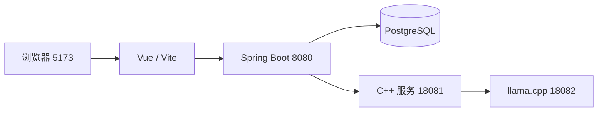

# StudyPilot 部署与运行指南

本指南对应当前目标架构，不适用于仓库中保留的早期课程版 MySQL 脚本。它把前端、Java、PostgreSQL、C++ 检索服务和本地模型连接为一个可在个人电脑运行的系统；不需要把数据库密码或模型文件提交到 Git。

## 本地演示模式（无需安装 PostgreSQL）

第一次查看页面和业务流程时，在仓库根目录执行：

```powershell
.\scripts\start-local-demo.ps1
```

脚本会依次启动临时 PostgreSQL、后端和前端，页面地址为 <http://127.0.0.1:5173/>。临时数据库使用正式数据库的同一套表结构，方便验收真实 JDBC 流程；停止服务后其数据不作为正式资料保留。需要长期保存资料或接入 C++ 检索与本地模型时，使用后文的目标架构。

在已启动本地演示或目标后端的情况下，可执行真实浏览器链路验收：

```powershell
cd frontend
$env:STUDYPILOT_REAL_API = 'true'
pnpm exec playwright test project-start.real-api.spec.ts
```

## 1. 运行结构



浏览器只访问前端地址。Vite 将 `/api` 转发给 Java；Java 再访问数据库和内部 C++ 服务，因此模型端口不暴露给浏览器。

## 2. 首次准备

需要 Java 21、Node.js 20+、pnpm、PostgreSQL 客户端 `psql`、可编译 C++17 的 Visual Studio 工具链，以及可运行 GGUF 模型的 llama.cpp。依赖安装目录和模型文件可自行选择；项目运行数据默认位于 D 盘：

```powershell
New-Item -ItemType Directory -Force `
  D:\大四课程设计\StudyPilot-runtime\uploads, `
  D:\大四课程设计\StudyPilot-runtime\ai-index, `
  D:\大四课程设计\StudyPilot-output | Out-Null

cd <StudyPilot 仓库目录>\frontend
pnpm install

cd ..\ai
.\build.cmd
```

`ai\bin\study-ai.exe` 是 C++ 服务。编译产物、模型、索引、日志和测试记录均不应提交；只有源码、脚本和说明文档进入 Git。

## 3. 配置 PostgreSQL

创建一个供本机或小组共享测试使用的 PostgreSQL 数据库，再在当前 PowerShell 会话设置连接变量。以下为变量格式示例，不是可直接使用的账号：

```powershell
$env:STUDYPILOT_DB_URL = 'jdbc:postgresql://127.0.0.1:5432/studypilot'
$env:STUDYPILOT_DB_USERNAME = '<数据库用户名>'
$env:STUDYPILOT_DB_PASSWORD = '<数据库密码>'
```

首次初始化数据库时执行：

```powershell
cd <StudyPilot 仓库目录>
.\backend\scripts\verify-schema.ps1
```

该脚本以固定顺序执行七份幂等 DDL。它不会保存连接信息，也不会删除既有数据；升级已有数据库时应按 [数据库演进记录](关键记录/数据库演进记录.md) 新增迁移，而不是修改旧表后假设会自动生效。

## 4. 启动模型与 C++ 服务

先启动本地 llama.cpp 服务，监听 `127.0.0.1:18082`。模型文件路径需替换成自己的 GGUF 文件；4060 8GB 建议使用 4B 左右的 Q4 量化模型并保留足够系统内存。

```powershell
<llama.cpp 目录>\llama-server.exe `
  -m 'D:\模型\your-model.gguf' `
  --host 127.0.0.1 --port 18082 -ngl 99
```

如果为模型服务设置 API Key，在启动 C++ 前在同一会话设置 `STUDY_MODEL_KEY`，并在 llama-server 使用同一个 Key。可先访问 `http://127.0.0.1:18082/health` 确认模型就绪。

## 5. 一键启动目标架构

在已配置数据库变量、已启动模型服务的 PowerShell 会话中执行：

```powershell
cd <StudyPilot 仓库目录>
.\scripts\start-target.ps1 -StartAiService
```

`-StartAiService` 会启动 C++ 服务并将索引写入 `D:\大四课程设计\StudyPilot-runtime\ai-index`；脚本接着启动 Java 8080 和 Vite 5173。浏览器访问 `http://127.0.0.1:5173`。首次连接一个空数据库时可附加 `-ApplySchema`，但需要已安装 `psql`。

日志和进程记录默认写入 `D:\大四课程设计\StudyPilot-output`。若电脑没有 D 盘，可以只在当前会话覆盖：

```powershell
$env:STUDYPILOT_OUTPUT_ROOT = 'E:\StudyPilot-output'
$env:STUDYPILOT_STORAGE_ROOT = 'E:\StudyPilot-runtime\uploads'
```

停止本脚本启动的服务：

```powershell
.\scripts\stop-target.ps1
```

停止脚本会核对 PID 与启动时间，因此不会因为 PID 被系统复用而终止无关程序。模型服务由用户单独启动，也需在其原窗口手动停止。

## 6. 测试与证据

执行完整可自动化验证：

```powershell
.\scripts\verify-target.ps1
```

它依次运行后端 Maven 测试、前端质量检查、Harness 状态检查和模拟卷 HTTP 工作流。测试会启动独立 Embedded PostgreSQL，不使用上述数据库账号；工作流中的模型与检索 Gateway 受控，以保证结构化 JSON 的结果可重复。每次的命令日志和验证摘要默认写入 `D:\大四课程设计\StudyPilot-output`。

真实本地模型链路另有资料问答端到端测试。须先按第 4、5 节启动依赖，再运行：

```powershell
cd backend
.\mvnw.cmd -Dstudypilot.e2e=true -Dtest=GroundedQaEndToEndTest test
```

若本机已执行一次 `pnpm exec playwright install chromium`，可将真实 Chromium 浏览器场景也纳入统一验证：

```powershell
.\scripts\verify-target.ps1 -RunBrowser
```

该场景会启动临时 Vite 服务，验证创建项目后进入对应项目的问答空间。Playwright 的 HTML、JSON 与失败证据默认保存在 `D:\大四课程设计\StudyPilot-output\playwright`。

运行结果与限制见 [系统验证记录](产品相关/系统验证记录.md)。

## 7. 组员协作方式

组员克隆仓库后按本指南准备本机依赖，在独立分支修改代码。提交前至少运行 `pnpm run check`、`backend\mvnw.cmd test` 和 `scripts\harness-check.ps1`；可运行 `verify-target.ps1` 汇总为一次完整检查。不要提交 `StudyPilot-runtime`、`StudyPilot-output`、数据库密码、模型文件、日志或个人 IDE 配置。
