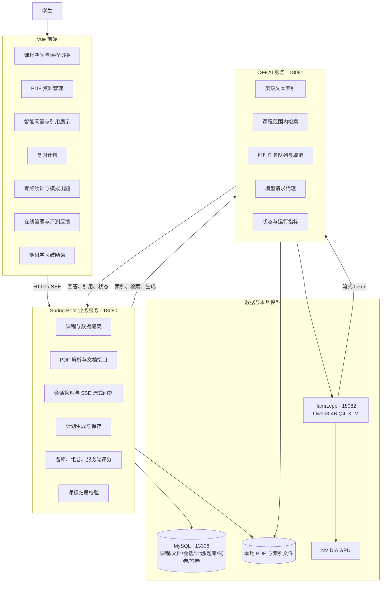
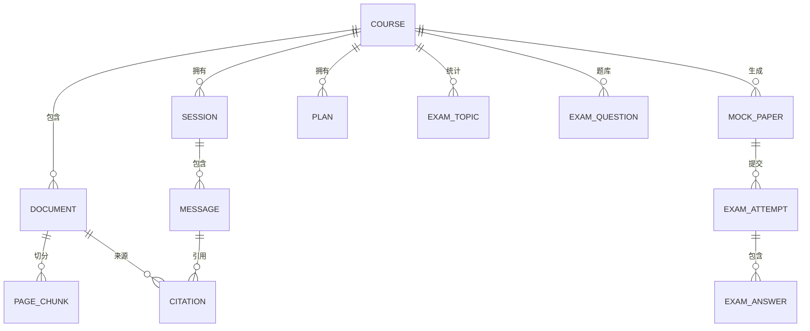
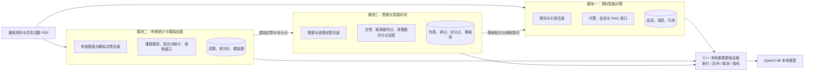

# 知序 StudyPilot 项目架构图

## 当前实现版本

当前数据隔离关系：

## 模块协作架构

课程、PDF、模型服务和数据库作为公共基础，三名成员分别负责一条完整的前后端业务链路。

三个目标模块共用以下约定：

- 所有文档、试题、会话、练习和评测记录都绑定课程编号。
- 前端统一调用 Spring Boot，避免直接访问本地模型。
- Java 负责业务规则、数据库事务和数据校验，C++ 负责检索、推理队列及运行指标。
- 模拟试卷在 Java 服务端关联题目；参考答案和评分点只在服务端保存，不传给浏览器。
- 客观题由 Java 确定性判分；简答题先按评分点给出稳定反馈，后续可接入本地模型生成更丰富的讲解。
- 当前提供一套数据库基础演示题库，用于离线体验完整流程；实际课程可由资料整理环节写入课程专属题库。
